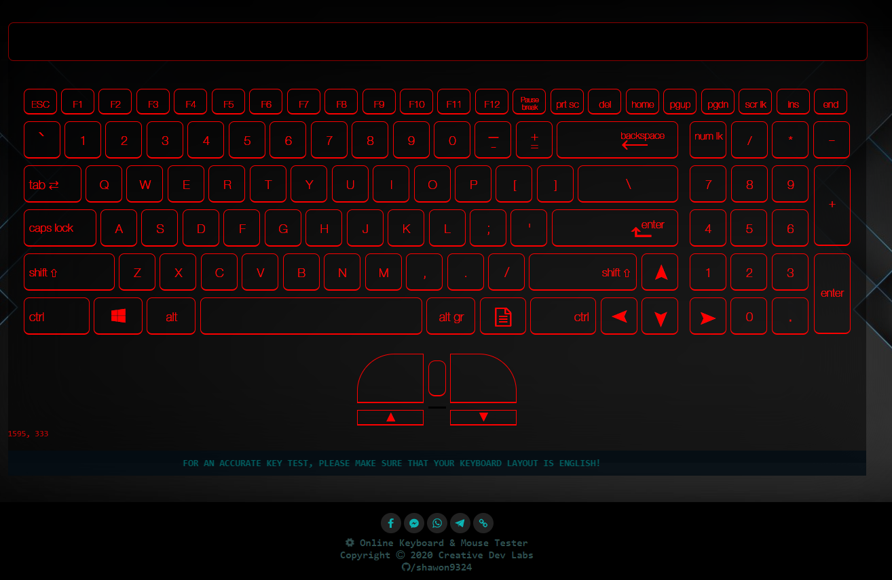
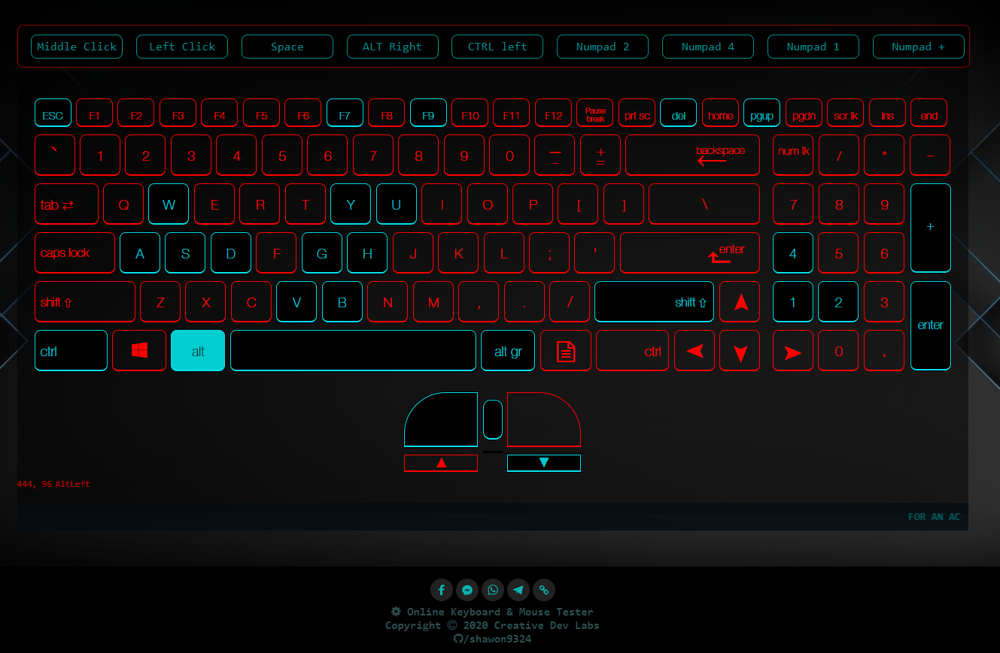

# Online Keyboard & Mouse Tester

<h2>hi geeks,Welcome!</h2>

<h4>Features</h4>

<ul>
    <li>Supported by any Keyboard (English Layout)</li>
    <li>Both the down stroke and the up stroke are highlighted in different colors.</li>
    <li>Display the name of the pressed KEY</li>
    <li>Differentiate between duplicate keys (SHIFT,ALT,CTRL,ENTER)</li>
    <li>Total 106 different keys test</li>
    <li>Available : Mouse Left,RIght,Middle key & Scroll Up,Scroll Down tests </li>
    <li>User friendly UI</li>
</ul>

<h4>CHECK THIS APPS LIVE: <a href="https://shawon9324.github.io/apps/keytester ">https://shawon9324.github.io/apps/keytester </a></h4>

## MAIN PAGE:

## WORKING PROCESS:

